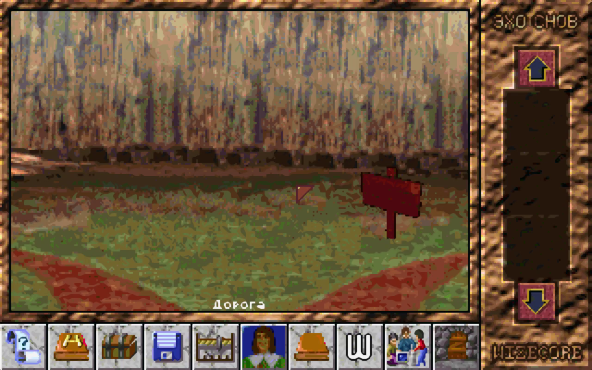
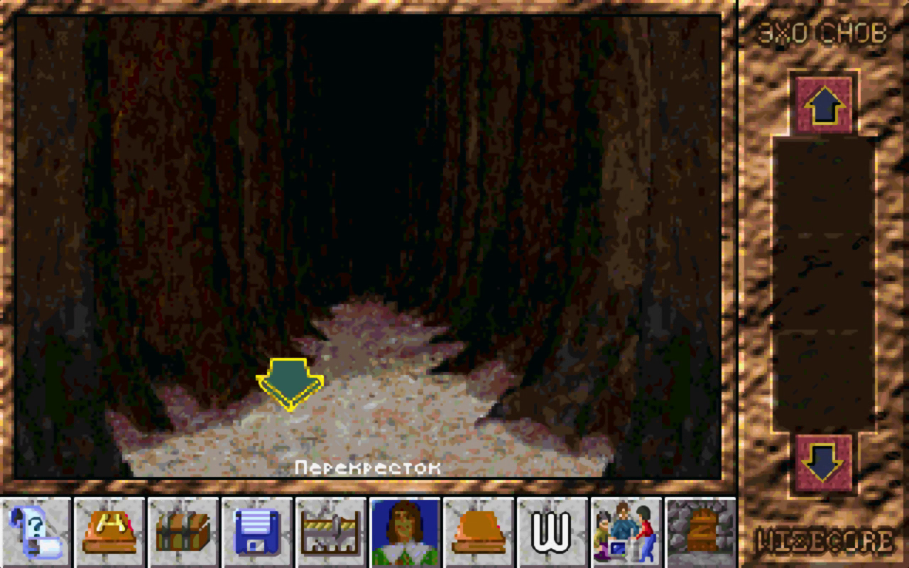
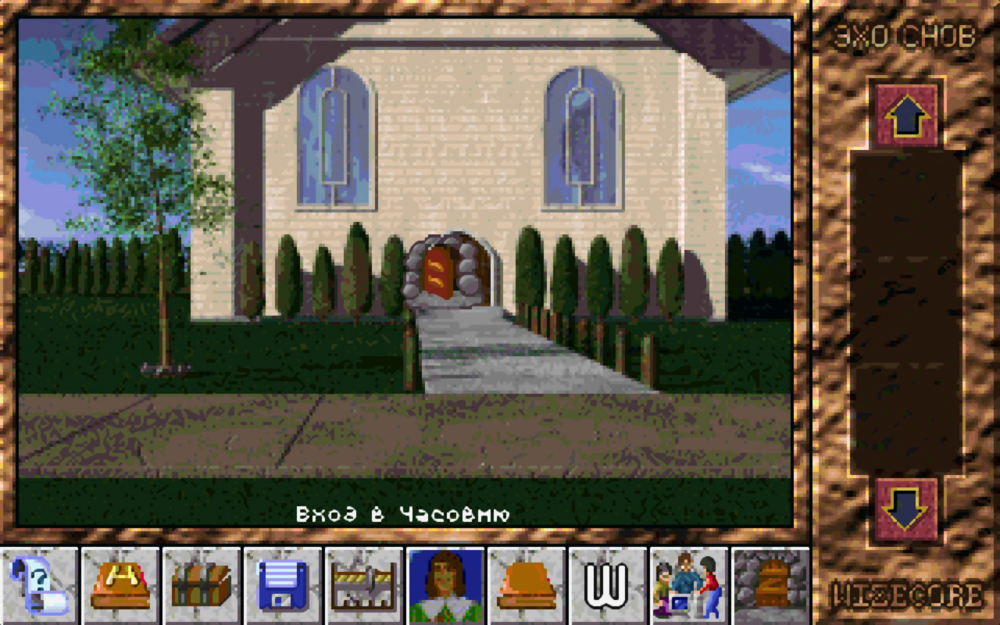
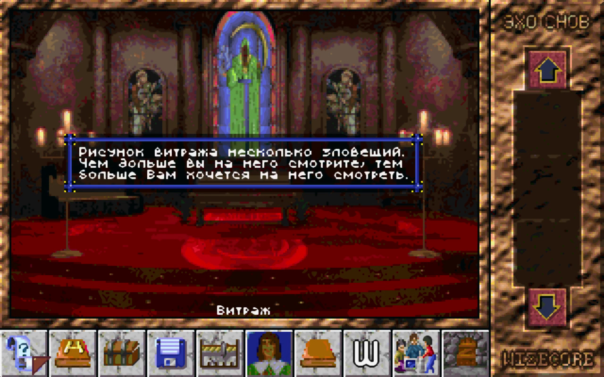
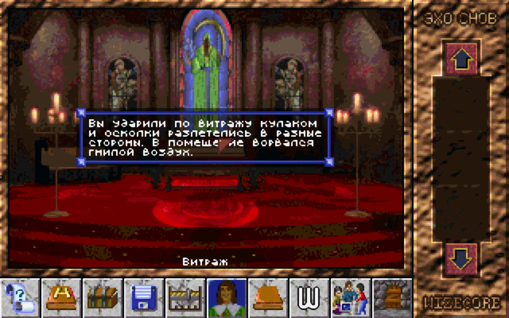
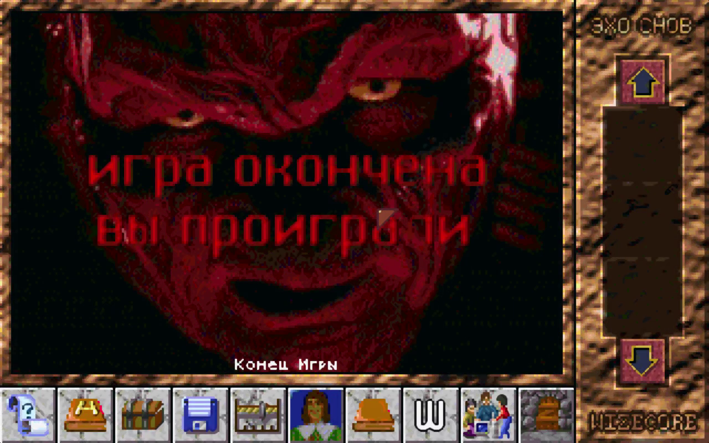

# Echo of Dreams

This is source code for game "Echo of dreams"
written in 1997.

Video (in russian) about it: https://www.youtube.com/watch?v=zAwNgZmC9bE

Interface demo: https://www.youtube.com/watch?v=5jstFgeUAUE

## DISCLAIMER

All graphics in this game are from other games of that decade!
Original developers used this graphics in non-commercial way to show scripting engine capabilities.

## Information about game

- Borland Pascal 7.0
- Uses 320x200 VGA mode
- FLASH SYSTEM - scripting engine for writing games

## Files included

- READ_ME.1ST Introduction and description in Russian
- READ_ME.2ST Additional information in Russian
- FILE_ID.DIZ BBS style file description in Russian

## Links

- Links to authors on Fidonet: http://faqs.org.ru/progr/graph/gamemake.htm
- Rutracker dvd menu release: http://rutracker.org/forum/viewtopic.php?t=3988793
